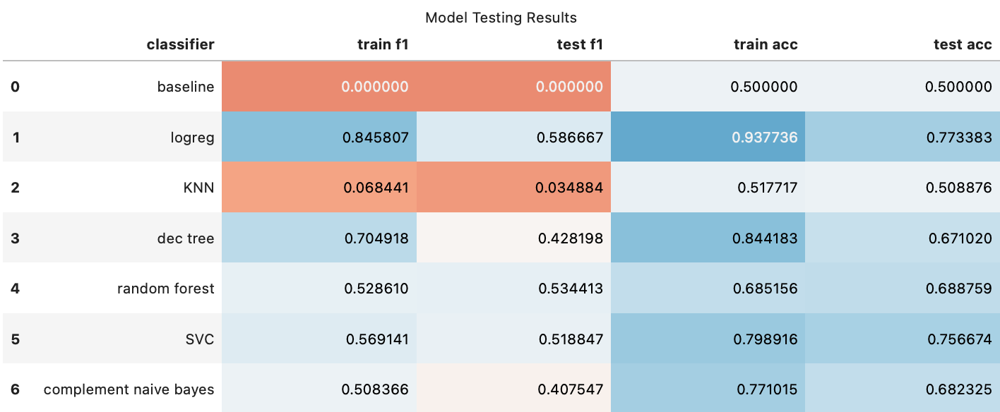

<!-- PROJECT SHIELDS -->

[![Contributors][contributors-shield]][contributors-url]
[![Forks][forks-shield]][forks-url]
[![Stargazers][stars-shield]][stars-url]
[![MIT License][license-shield]][license-url]
[![LinkedIn2][linkedin-shield]][linkedin-url]

<!-- PROJECT LOGO -->
 

  

<h2 align="center"> Hackathon: Buyer Analysis & Classification </h2>

Completed for General Assembly, 2022

 
 

<!-- ABOUT THE PROJECT -->

## About the Project

This project was completed individually as part of a full-day solo hackathon for GA's Data Science Immersive. Guidelines and requirements for this project are available  in the [Project-Instructions file](https://github.com/rowangayleschaefer/hackathon_project/blob/main/Project-Instructions.md). 

Project was completed in a working day (the presentation and readme were completed afterward for use in portfolio.) The [.ipynb file](https://github.com/rowangayleschaefer/hackathon_project/blob/main/hackathon.ipynb) provides summary statistics on a dataset of buyer transactions from an online retailer, and multiple machine learning models are used to predict probability of customers buying a specific item based on their past transaction history.

This was a very unique dataset - I would have liked to have additional info on the type of retailer this was from, because some of the products were unusual!

 

  
### Research Questions

* Which products are most popular worldwide, and by country?
* What is the likelihood of a customer purchasing <code>item 1</code>, given their past purchases?
* Which purchases are most important in determining the probability of a customer purchasing <code>item 1</code>?

 

### Software Requirements

Note that some formatting for tables and vizualizations will not render unless you run this on your local machine, rather than viewing project via github.

To run this code, you will need python installed (3.8.0 or higher recommended).  

Libraries used include:
* Pandas
* NumPy
* MatPlotLib
* Seaborn
* SciKitLearn

 

### Data
The data I chose was a dataset on customer transactions from 2010-2011 for an online retailer, made public by the UC Irvine Machine Learning Repository. Documentation and full dataset can be downloaded [here.](https://archive.ics.uci.edu/ml/datasets/online+retail) 

(<a href="#top">back to top</a>)

 

<!-- PROCESS -->
## Process

<!-- DATA CLEANING -->
#### Data Cleaning & EDA

Data cleaning and EDA sections are located in the first half of the [project file.](https://github.com/rowangayleschaefer/hackathon_project/blob/main/hackathon.ipynb) This section took the most time to complete. Summary statistics for purchases are provided. 

 

<!-- MODELING -->
#### Modeling

The modeling section is located in the second half of the [project file.](https://github.com/rowangayleschaefer/hackathon_project/blob/main/hackathon.ipynb)
  
Multiple classification models were tested to predict the likelihood of a customer purchasing a popular item, 'ASSORTED COLOUR BIRD ORNAMENT' based on data about their other purchases. I chose this item for modeling based on EDA because it was purchased by a large number of individual buyers, across a wide variety of countries.
  
* My data had imbalanced classes, I chose to combat this by using balanced_accuracy, f1_score, and class weights with each model due to time constraints. Preliminary models include Random Forest, SVC, Logistic Regression, and Naive Bayes.

* My baseline model predicted the majority class (not buying a bird ornament), and had a f1 score of 0 and balanced accuracy of 0.50 on the testing set. 
  
* I had several models that outperformed the baseline: despite being overfit, the Logistic Regression performed best on the testing set, with test f1 of .58 and balanced accuracy score of .77. If I revisited this model, I would try limiting features based on the feature_importances from my Random Forest model; this may help prevent overfitting.
  
* The SVC model also performed relatively well after tuning hyperparameters to prevent overfitting. 

 

  

*Of note, the KNN model performed exceptionally badly compared to other models - this is likely because SciKitLearn's KNN class can't take class weights as a parameter without altering the source code. If I had additional time and wanted to improve this model, I'd focus on using additional strategies to balance the classes in my data.*
 

 

<!-- NEXT STEPS -->
### Next Steps
**Taking a look at preliminary models, there are a couple steps I could take next, given more time to complete the project:**

* Attempting to further reduce overfitting for the two best models (Logistic Regression and SVC), and using Logistic Regression with better feature selection.
* Trying ensembling methods with my best models to create a better-performing model.
* PCA to reduce dimensionality, given the high number of features (products) in the dataset. Or MCA/PCA alternatives, if using boolean data.
* Pulling in additional data or training a model to create categories and subcategories for each item.
* A deeper dive into feature importances for each model.
* Trying additional strategies to balance data.
 

**Additionally, here some other ideas that I could explore for this dataset:**

* Looking at cosine similarity for products and building a product recommender based on previous products ordered.
* Clustering buyers based on their buying habits, or doing customer segmentation with available data.
* Building an app that allows a user to select the item they want to model for.
 

 

<!-- CONTRIBUTING -->
## Contributing

If you have a suggestion that would make this better, please fork the repo and create a pull request. You can also simply open an issue with the tag "enhancement".
Don't forget to give the project a star! Thanks again!

1. Fork the Project
2. Create your Feature Branch (`git checkout -b feature/AmazingFeature`)
3. Commit your Changes (`git commit -m 'Add some AmazingFeature'`)
4. Push to the Branch (`git push origin feature/AmazingFeature`)
5. Open a Pull Request

(<a href="#top">back to top</a>)

<!-- CONTACT CONTRIBUTORS -->
## Contact Contributors

Rowan - [linkedin](https://linkedin.com/in/rowanschaefer) - [github](https://github.com/rowangayleschaefer) - rgscha02@gmail.com  

[Project Link](https://github.com/rowanschaefer/hackathon_project)

(<a href="#top">back to top</a>)

<!-- LICENSE -->
## License

Distributed under the MIT License. See `LICENSE.txt` for more information.

(<a href="#top">back to top</a>)

<!-- MARKDOWN LINKS & IMAGES -->
<!-- https://www.markdownguide.org/basic-syntax/#reference-style-links -->
[contributors-shield]: https://img.shields.io/github/contributors/rowangayleschaefer/hackathon_project.svg?style=for-the-badge
[contributors-url]: https://github.com/rowangayleschaefer/hackathon_project/graphs/contributors
[forks-shield]: https://img.shields.io/github/forks/rowangayleschaefer/hackathon_project.svg?style=for-the-badge
[forks-url]: https://github.com/rowangayleschaefer/hackathon_project/network/members
[stars-shield]: https://img.shields.io/github/stars/rowangayleschaefer/hackathon_project.svg?style=for-the-badge
[stars-url]: https://github.com/rowangayleschaefer/hackathon_project/stargazers
[issues-shield]: https://img.shields.io/github/issues/rowangayleschaefer/hackathon_project.svg?style=for-the-badge
[issues-url]: https://github.com/rowangayleschaefer/hackathon_project/issues
[license-shield]: https://img.shields.io/github/license/rowangayleschaefer/hackathon_project.svg?style=for-the-badge
[license-url]: https://github.com/rowangayleschaefer/hackathon_project/blob/master/LICENSE.txt
[linkedin-shield]: https://img.shields.io/badge/-LinkedIn-black.svg?style=for-the-badge&logo=linkedin&colorB=555
[linkedin-url]: https://linkedin.com/in/rowanschaefer

